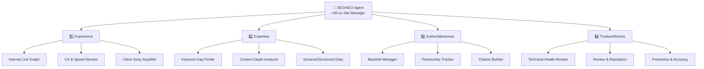

# RxFit SEO/AEO Agent Blueprint
## Autonomous E-E-A-T Site Manager for rxfit.co

**Date:** March 9, 2026  
**Version:** 1.0 — Design Proposal

---

## Concept

An autonomous AI agent whose **sole mission** is to improve and maintain rxfit.co's search rankings across both traditional search engines (Google, Bing) and AI answer engines (ChatGPT, Perplexity, Google AI Overviews, voice assistants). It operates strictly within the four **E-E-A-T pillars** — every action it takes maps to one or more of these pillars.

> [!IMPORTANT]
> This agent does NOT create content from scratch, run social media, or handle paid ads. It is a **site-focused ranking optimizer** that works alongside PerfectusLabs (SEO vendor) and your content team.

---

## Architecture: The 4 Pillars as Agent Modules

---

## Pillar 1: Experience
*"Does this site demonstrate real-world experience with the subject?"*

### What the Agent Manages

#### 1.1 Internal Link Graph Manager
- **Scans** every new blog post and identifies opportunities to link to existing articles
- **Generates** internal linking recommendations (e.g., "In your new article about shoulder impingement, link to your existing articles on corrective exercise and functional movement")
- **Tracks** orphan pages (pages with zero internal links pointing to them)
- **Monitors** link depth — ensures important service pages are ≤3 clicks from homepage

| Input | Action | Output |
|:---|:---|:---|
| New blog post draft | Scan existing content for link opportunities | List of 3-7 suggested internal links with anchor text |
| Monthly audit | Identify orphan pages and broken internal links | Orphan page report + fix suggestions |

#### 1.2 UX & Speed Monitor
- **Runs weekly PageSpeed tests** on key pages (homepage, service pages, blog)
- **Alerts** when mobile LCP exceeds 2.5s or any Core Web Vital degrades
- **Tracks** plugin inventory — flags unused/heavy plugins that PerfectusLabs may have missed
- **Monitors** HostGator uptime — logs slow response events with timestamps for support tickets
- **Theme monitoring** — detects layout shifts, broken responsive elements on mobile vs desktop

| Input | Action | Output |
|:---|:---|:---|
| Scheduled (weekly) | Run PageSpeed Insights API | Performance scorecard with trend graph |
| Speed anomaly detected | Log timestamp, response time, affected pages | Pre-written HostGator support ticket |
| Plugin scan (monthly) | Audit active WP plugins | Recommendations to deactivate/replace |

#### 1.3 Client Story Amplifier
- **Monitors** the testimonials page for new video embeds and ensures text transcripts are added
- **Identifies** client success stories from blog posts that should be repurposed as case study schema
- **Adds** `Review` structured data for each testimonial

---

## Pillar 2: Expertise
*"Does this site demonstrate deep knowledge in its field?"*

### What the Agent Manages

#### 2.1 Keyword Gap Finder
- **Ingests** keyword lists from PerfectusLabs (their planned targets for next 2-3 months)
- **Cross-references** with problem-based queries the site currently **doesn't** rank for:
  - "shoulder impingement exercises Austin"
  - "fix lower back pain personal trainer"
  - "joint pain relief fitness program"
  - "post-surgery rehab personal training"
- **Generates** content briefs aligned to both PerfectusLabs' keyword targets AND problem-based queries
- **Coordinates** blog topics with newsletter content calendar

| Input | Action | Output |
|:---|:---|:---|
| PerfectusLabs keyword list | Gap analysis against problem-based queries | Unified keyword map with blog topic suggestions |
| Monthly search trends | Identify emerging fitness/health queries in Austin | New keyword opportunities report |

#### 2.2 Content Depth Analyzer
- **Scores** each blog post and service page for topical depth
- **Identifies** pages that are "thin" (< 800 words, no subheadings, no data points)
- **Recommends** content expansions with specific sections to add (e.g., "Add a 'What causes shoulder impingement?' section with anatomical explanation")
- **Tracks** content-to-keyword alignment — does each target keyword have a corresponding in-depth page?

#### 2.3 Schema & Structured Data Manager
- **Maintains** all JSON-LD markup across the site:
  - `FAQPage` on service pages (auto-generates from FAQ sections)
  - `HowTo` on relevant blog posts
  - `LocalBusiness` with service areas, hours, pricing
  - `Person` schema for each trainer with credentials
  - `Article` / `BlogPosting` with `dateModified` timestamps
- **Validates** schema against Google's Rich Results Test after every change
- **Monitors** for schema deprecations or new schema types that could benefit the site

---

## Pillar 3: Authoritativeness
*"Is this site recognized as a leading source in its industry?"*

### What the Agent Manages

#### 3.1 Backlink Intelligence
- **Monitors** existing backlink profile (referring domains, anchor text distribution)
- **Detects** lost backlinks and alerts for re-acquisition outreach
- **Identifies** competitor backlinks that RxFit doesn't have
- **Flags** toxic/spammy backlinks for disavow consideration

#### 3.2 Partnership Tracker
- **Maintains** a registry of potential and active backlink partnerships:
  - Bee Cave Acupuncture (wellness)
  - Local chiropractors, physical therapy clinics
  - Austin fitness bloggers/publications
  - VoyageAustin, Bark, Thumbtack (already linked)
- **Generates** outreach templates for backlink exchange proposals
- **Tracks** partnership status (proposed → contacted → active → link live)

| Partnership Stage | Agent Action |
|:---|:---|
| **Prospect** | Identify relevant Austin wellness businesses, check their domain authority |
| **Outreach** | Generate personalized outreach email draft |
| **Active** | Verify backlink is live and indexed, monitor for removal |
| **Reciprocal** | Ensure RxFit's outbound links to partners are in place |

#### 3.3 Citation & Mention Builder
- **Monitors** brand mentions of "RxFit" across the web that don't include a backlink
- **Generates** outreach requests to convert unlinked mentions into backlinks
- **Tracks** directory listings (Google Business Profile, Yelp, Thumbtack, Bark) for NAP consistency
- **Identifies** guest posting opportunities on Austin fitness/wellness blogs

---

## Pillar 4: Trustworthiness
*"Can users and search engines trust this site?"*

### What the Agent Manages

#### 4.1 Technical Health Monitor
- **Weekly** automated checks:
  - SSL certificate validity and expiration date
  - Mixed content warnings
  - Broken links (internal and external)
  - 404 errors in Google Search Console
  - Mobile usability issues
  - Sitemap accuracy (all pages included, no orphans)
  - robots.txt correctness
- **Plugin security audit** — flags plugins with known vulnerabilities or that are outdated
- **Hosting performance log** — tracks response times from HostGator, builds evidence for migration if needed

#### 4.2 Review & Reputation Signal Manager
- **Monitors** Google Business Profile reviews, Thumbtack reviews, Bark reviews
- **Ensures** `AggregateRating` schema reflects current review scores
- **Alerts** when a new negative review needs response
- **Tracks** review velocity — are you getting reviews at a steady pace?

#### 4.3 Content Freshness & Accuracy Engine
- **Scans** all blog posts for outdated statistics, broken external links, or stale references
- **Adds** "Last Updated" dates to posts and `dateModified` to schema
- **Flags** pages that haven't been updated in 6+ months for refresh
- **Verifies** all claims on the site are accurate (certifications mentioned, pricing if stated, etc.)

---

## Operational Cadence

```mermaid
gantt
    title SEO/AEO Agent Weekly Cycle
    dateFormat  X
    axisFormat %s
    
    section Daily
    Speed/uptime check           :0, 1
    Broken link scan             :0, 1
    
    section Weekly
    PageSpeed audit              :1, 2
    Internal link analysis       :1, 2
    Schema validation            :2, 3
    Keyword gap check            :2, 3
    
    section Biweekly
    Content depth scoring        :3, 5
    Partnership status review    :3, 5
    
    section Monthly
    Full backlink audit          :5, 9
    Plugin & theme review        :5, 9
    PerfectusLabs keyword sync   :5, 9
    Comprehensive report         :7, 9
```

### Agent Output: Monthly Report Card

Each month, the agent produces a single-page scorecard:

| E-E-A-T Pillar | Score | Trend | Top Action Item |
|:---|:---:|:---:|:---|
| Experience | 72/100 | ↑ +5 | Add transcripts to 3 video testimonials |
| Expertise | 65/100 | ↗ +2 | Create content for 4 problem-based keywords |
| Authoritativeness | 58/100 | → 0 | Bee Cave Acupuncture partnership pending |
| Trustworthiness | 81/100 | ↑ +3 | 2 plugins need updating |
| **Overall** | **69/100** | **↑ +3** | |

---

## Implementation Options

### Option A: Lightweight — Google Sheet + Scheduled Scripts
- Agent logic lives as a scheduled Node.js script in RxFit-MCP
- Reads/writes to a Google Sheet dashboard (your "source of truth" per user rules)
- Runs PageSpeed API, Screaming Frog exports, Search Console API
- Sends weekly Slack/email digest
- **Effort:** ~2-3 weeks to build
- **Best for:** Getting started fast with minimal infrastructure

### Option B: Full Agent — MCP-Integrated Autonomous Agent
- Runs as an MCP tool server alongside your existing RxFit-MCP setup
- Has its own tool set: `audit_page`, `check_speed`, `analyze_keywords`, `scan_backlinks`, `validate_schema`
- Can be triggered by voice command: "Run SEO health check" or "What's our keyword gap this month?"
- Writes reports to Google Drive
- **Effort:** ~4-6 weeks to build
- **Best for:** Full automation with voice/chat integration

### Option C: Hybrid — Agent + PerfectusLabs Coordination Layer
- Everything from Option B, plus:
- Dedicated workflow for ingesting PerfectusLabs keyword lists
- Automated content brief generation that aligns blog topics with their keyword targets
- Shared dashboard where both your team and PerfectusLabs can see priorities
- **Effort:** ~6-8 weeks to build
- **Best for:** Maximum coordination between your internal team and your SEO vendor

---

## Recommended Approach

> [!TIP]
> **Start with Option A** to prove the concept (2-3 weeks), then graduate to **Option B** once the monitoring loops are validated. Option C can layer on whenever PerfectusLabs is ready to share data programmatically.

### Phase 1 (Weeks 1-3): Foundation
1. Build the speed/health monitoring scripts (Pillar 4)
2. Set up the internal link analyzer (Pillar 1)
3. Create the Google Sheet dashboard with E-E-A-T scoring
4. Add FAQ & LocalBusiness schema to the site (Pillar 2 — immediate AEO wins)

### Phase 2 (Weeks 4-6): Intelligence
5. Build the keyword gap finder with PerfectusLabs coordination (Pillar 2)
6. Set up backlink monitoring and partnership tracker (Pillar 3)
7. Add content depth scoring and freshness alerts (Pillar 2 + 4)

### Phase 3 (Weeks 7-10): Autonomy
8. Migrate to MCP tool server for voice/chat integration
9. Add automated content brief generation
10. Build the monthly report card generator

---

## Key Design Principles

1. **Google Drive as source of truth** — All tracking data, partnership registries, and keyword maps live in Google Sheets, not a separate database
2. **Non-destructive** — The agent recommends changes but doesn't directly modify the WordPress site without approval
3. **Vendor-aware** — Designed to complement PerfectusLabs, not replace them. The agent fills gaps they're missing (problem-based keywords, speed monitoring, plugin audits, AEO)
4. **Measurable** — Every action maps to an E-E-A-T pillar with a quantifiable score, so you can track ROI month-over-month
